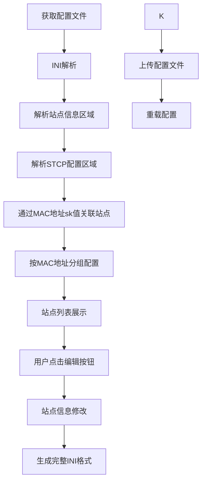

# frpc Web 界面 STCP 配置功能需求文档（完善版）

## 1. 项目概述

### 1.1 背景
frpc 客户端现有 Web 界面只提供文本编辑功能，用户需要手动编辑 INI 格式配置文件。为提升用户体验，需要为 STCP（Secret TCP）代理配置提供可视化编辑界面，支持批量导入和标签管理。

### 1.2 项目范围
- **目标**：仅改造 frpc 客户端 Web 界面前端代码
- **类型**：仅处理 STCP 类型的 visitor 角色代理配置
- **约束**：不修改后端代码，仅使用现有 API 接口

### 1.3 技术架构
- **现有技术栈**：Vue.js 2.5 + Element UI 2.5 + Vue Router 3.0
- **现有API**：GET/PUT `/api/config`、GET `/api/reload`、GET `/api/status`
- **配置格式**：INI 格式文件

## 2. 功能需求

### 2.1 站点管理模式

#### 2.1.1 核心设计理念
- **站点维度管理**：基于现有设备元配置区域，以站点为单位进行配置管理
- **兼容现有结构**：充分利用已存在的 `DEVICE_REGISTRY` 区域的设备信息
- **多端口管理**：每个站点包含多个端口配置（基础端口：22、3306、5000及其他特殊端口）
- **合并展示**：界面上显示站点信息，隐藏底层多个STCP配置的复杂性
- **智能识别**：根据设备ID前缀自动识别设备类型（R-辐射、E-烟气、W-水质、N-噪声、F-其他）

#### 2.1.2 站点信息结构（基于现有设备元配置）
利用现有 `DEVICE_REGISTRY` 区域的设备信息：
- **MAC地址**：设备MAC地址，作为站点的唯一标识符和STCP密钥（如：8ED17CFC9965）
- **站点编号**：站点的显示标识符（如：009）
- **站点名称**：站点的显示名称（如：辐射监测站）
- **加密密码**：设备访问密码（如：8ED17CFC9965）
- **标签**：站点分类标签（如：辐射,在线,核电）

**核心关联逻辑**：
- **站点识别**：通过MAC地址识别同一个站点，MAC地址作为站点的唯一标识
- **配置关联**：设备元配置与STCP代理配置通过MAC地址关联（MAC地址 = sk值）
- **配置归类**：所有sk值相同的STCP配置自动归属到同一个站点
- **设备分类**：根据站点编号前缀识别设备类型（可选功能）

#### 2.1.3 站点列表展示
- 以表格形式展示站点列表，包含字段：
  - 站点编号
  - 站点名称
  - 密码（编辑模式下显示，非编辑模式下显示为"未设置"或具体值）
  - MAC地址（仅在编辑模式下显示）
  - 端口（非编辑模式下显示所有端口，如：22, 3306, 5000）
  - 标签
  - 操作列：包含多个快速访问按钮
    - **访问按钮**：点击后浏览器自动访问该站点5000端口的代理地址
    - **SSH按钮**：点击后复制SSH连接命令到剪贴板（如：`ssh -p 18000 user@localhost`）
    - **MySQL按钮**：点击后复制MySQL连接命令到剪贴板（如：`mysql -h localhost -P 18001 -u root -p`）
    - **BS按钮**：预留的BS功能按钮
    - **代理配置按钮**：仅在编辑模式下显示，点击进入该站点的详细代理配置管理
    - **示例**：如果当前访问frpc web界面的地址是 `192.168.1.100:7400`，某站点5000端口映射到18002，则点击访问按钮后自动打开 `http://192.168.1.100:18002`

#### 2.1.4 站点管理操作
- **编辑模式切换**：页面右上角提供"编辑"/"完成"按钮，控制整个页面的编辑状态
- **基础信息编辑**：在编辑模式下，表格中的字段变为可编辑状态
  - **可编辑字段**：站点编号、站点名称、密码
  - **只读字段**：MAC地址（作为唯一标识符，不允许修改）
  - **标签编辑**：在编辑模式下，显示所有可用标签作为按钮，点击可添加/移除标签，支持通过"添加"按钮输入新标签
  - **示例**：进入编辑模式后，站点名称"苏州辐射站"变为可编辑的输入框，标签区域显示所有标签按钮，可点击选择或取消选择
- **代理配置管理**：在编辑模式下提供"代理配置"按钮，点击后打开弹窗显示该站点的详细代理配置
  - **配置编辑表格**：显示配置名称、类型、服务名称、绑定端口等字段，均可直接编辑
  - **新增配置**：通过"新增端口配置"按钮添加新的代理配置
  - **删除配置**：每行提供删除按钮，可删除不需要的配置
  - **保存/取消**：配置编辑完成后需要点击保存或取消按钮
- **批量导入**：在编辑模式下提供"批量导入"按钮，打开批量导入对话框
- **配置文件编辑**：在编辑模式下提供"配置文件"按钮，打开文本编辑器直接编辑配置文件

### 2.2 批量导入功能

#### 2.2.1 导入数据格式
- **输入格式**：每行包含 `站点编号 MAC地址 [站点名称]`
- **示例**：
  ```
  DC20240102 E721EE345A2 苏州辐射站
  DC20240103 F821EE345B3 太平岭01
  DC20240104 G921EE345C4
  DC20240105 G921EE345C5
  ```
- **说明**：
  - 站点编号为必填字段，作为第一个字段
  - MAC地址为必填字段，作为第二个字段
  - 站点名称为可选字段，如未提供则使用站点编号作为名称

#### 2.2.2 站点自动生成规则
批量导入时，为每个站点自动生成完整的站点配置：
- **站点信息生成**：
  - 站点编号：直接使用导入数据的第一个字段
  - MAC地址：直接使用导入数据的第二个字段（作为唯一标识符）
  - 站点名称：使用提供的名称，如未提供则使用站点编号
  - 加密密码：默认为空，用户可后续编辑
  - 标签：默认为空，可后续编辑
- **端口配置生成**：为每个站点自动生成 STCP visitor 配置
  - **默认端口模板**：22、3306、5000
  - **配置名称模板**：`R-{MAC地址}-{端口}`（如：R-E721EE345A2-22）
  - **服务名称模板**：`R-{MAC地址}-{端口}`
  - **密钥**：使用MAC地址作为sk值
  - **绑定地址**：固定为 `0.0.0.0`
  - **绑定端口**：根据现有端口分配规律自动分配，避免冲突
- **后续配置管理**：用户可通过配置管理功能增加、删除或修改端口配置

#### 2.2.3 端口自动分配逻辑
简化的端口分配策略：
- **分配起始端口**：demo中从18015开始分配（避免与现有demo数据冲突）
- **分配策略**：按数字递增顺序分配，每个配置分配一个唯一端口
- **冲突处理**：检查端口是否已被使用，如已使用则分配下一个可用端口
- **分配顺序**：按导入顺序依次分配端口
- **分配结果展示**：显示每个配置的最终端口分配
- **分配示例**：
  ```
  站点A（站点编号: DC20240107, MAC: E721EE345A3）导入时：
  - 端口22 -> 分配绑定端口18015
  - 端口3306 -> 分配绑定端口18016
  - 端口5000 -> 分配绑定端口18017
  
  站点B（站点编号: DC20240108, MAC: F821EE345B4）导入时：
  - 端口22 -> 分配绑定端口18018
  - 端口3306 -> 分配绑定端口18019
  - 端口5000 -> 分配绑定端口18020
  ```

### 2.3 标签管理功能

#### 2.3.1 标签系统
- **标签格式**：多个标签用逗号分隔
- **标签用途**：用于配置分类和筛选
- **预设标签**：辐射、烟气、水质、噪声、测试、在线等
- **自定义标签**：用户可添加新标签

#### 2.3.2 标签操作
- **标签筛选面板**：点击"标签筛选"按钮展开/收起标签筛选面板
- **标签筛选**：根据标签筛选配置列表（"或"逻辑）
  - **筛选逻辑**：选择多个标签时，显示包含任一标签的站点（OR逻辑）
  - **标签按钮**：每个标签显示为按钮，显示标签名称和对应站点数量
  - **筛选统计**：显示当前选择的标签数量和匹配的站点数量
  - **清除筛选**：提供清除按钮，一键清除所有选中的标签筛选
  - **示例**：
    - 选择"辐射"标签：显示所有包含"辐射"标签的站点
    - 选择"辐射"和"苏州"标签：显示包含"辐射"或"苏州"标签的所有站点
    - 筛选面板显示：`测试(1) 在线(4) 辐射(2) 太平岭(1) 水质(1) 苏州(2) 噪声(1) 烟气(1) 无标签(0)`
- **标签编辑**：在编辑模式下，标签区域显示为可点击的按钮，支持添加/移除标签
  - **添加标签**：通过"添加"按钮输入新标签并添加到站点
  - **移除标签**：点击已选中的标签按钮可移除该标签

### 2.4 设备信息存储与解析（基于现有结构）

#### 2.4.1 设备信息存储格式（使用现有DEVICE_REGISTRY）
利用现有的设备元配置区域：
```ini
# ==================== 设备元配置区域 ====================
# 格式：MAC地址|站点编号|站点名称|加密密码|标签
# 标签：多个标签用逗号分隔，仅用于筛选分类
# DEVICE_REGISTRY_START

# 辐射监测站
# E721EE345A2|DC20240102|苏州辐射站|bs123456|测试,在线,辐射
# F821EE345B3|DC20240103|太平岭01|bs789012|辐射,太平岭,在线

# DEVICE_REGISTRY_END

[R-E721EE345A2-22]
type = stcp
role = visitor
server_name = R-E721EE345A2-22
sk = E721EE345A2
bind_addr = 0.0.0.0
bind_port = 18000

[R-E721EE345A2-3306]
type = stcp
role = visitor
server_name = R-E721EE345A2-3306
sk = E721EE345A2
bind_addr = 0.0.0.0
bind_port = 18001

[R-E721EE345A2-5000]
type = stcp
role = visitor
server_name = R-E721EE345A2-5000
sk = E721EE345A2
bind_addr = 0.0.0.0
bind_port = 18002
```

#### 2.4.2 配置文件处理
- **双向解析**：
  - 解析设备元配置区域（DEVICE_REGISTRY）获取设备数据
  - 解析STCP配置段获取端口配置
  - 根据命名规则和sk值关联设备与其端口配置
- **智能识别**：
  - 自动识别 `type = stcp` 且 `role = visitor` 的配置段
  - 根据sk值（MAC地址）归类STCP配置到对应设备
  - 通过sk值匹配设备元配置区域中的MAC地址
  - **关联示例**：
    ```
    设备信息：E721EE345A2|DC20240102|苏州辐射站|bs123456|测试,在线,辐射
    对应的STCP配置：
    - [R-E721EE345A2-22] (sk = E721EE345A2)
    - [R-E721EE345A2-3306] (sk = E721EE345A2)
    - [R-E721EE345A2-5000] (sk = E721EE345A2)
    
    系统通过sk值E721EE345A2将这些配置归类到"苏州辐射站"
    ```
- **数据关联**：
  - 设备信息与STCP配置通过MAC地址（sk值）保持关联关系
  - MAC地址作为不变的唯一标识符，系统中不允许修改
  - **关联说明**：修改站点名称、标签等信息时，不影响STCP配置，因为关联通过不可变的MAC地址维持
  - **MAC地址保护**：界面上MAC地址字段为只读，防止误操作破坏关联关系
- **注释保留**：保留非设备管理的配置和注释内容

#### 2.4.3 数据持久化
- **基于现有结构**：
  - 设备信息：存储在INI文件的DEVICE_REGISTRY区域
  - 扩展数据：UI状态等存储在 localStorage
  - STCP配置：继续使用原有的INI section格式
- **配置同步**：与服务器配置文件保持同步

## 3. 技术实现

### 3.1 核心组件
- **SiteManager**：站点信息管理器（新增核心组件）
- **ProxyConfigManager**：单个站点的代理配置管理器（新增组件）
- **QuickAccessManager**：快速访问管理器，处理5000端口访问链接生成
- **INIParser**：INI 格式解析和生成器（扩展支持站点信息区域）
- **STCPManager**：STCP 配置管理器（调整为站点关联模式）
- **PortAllocator**：端口自动分配器
- **TagManager**：标签管理器

### 3.2 数据流程


### 3.3 关键算法

#### 3.3.1 端口分配算法
```javascript
function allocatePort(existingPorts) {
    let port = 18000; // 从18000开始分配
    
    // 查找下一个可用端口
    while (existingPorts.includes(port)) {
        port++;
    }
    
    return port;
}

// 批量分配端口的辅助函数
function allocatePorts(existingPorts, count) {
    const allocatedPorts = [];
    let currentPort = 18000;
    
    while (allocatedPorts.length < count) {
        if (!existingPorts.includes(currentPort)) {
            allocatedPorts.push(currentPort);
            existingPorts.push(currentPort); // 标记为已使用
        }
        currentPort++;
    }
    
    return allocatedPorts;
}
```

#### 3.3.2 批量生成算法
```javascript
function generateBatchConfigs(siteCode, macAddress, siteName) {
    const ports = [22, 3306, 5000];
    const configs = [];
    
    // 为当前站点分配3个连续端口
    const bindPorts = allocatePorts(existingPorts, ports.length);
    
    ports.forEach((port, index) => {
        configs.push({
            name: `${siteCode}-${port}`,
            type: 'stcp',
            role: 'visitor',
            server_name: `${siteCode}-${port}`,
            sk: macAddress,
            bind_addr: '0.0.0.0',
            bind_port: bindPorts[index]
        });
    });
    
    return configs;
}

// 使用示例：
// 输入：站点编号=009, MAC=8ED17CFC9965, 站点名称=辐射监测站
// 输出：生成3个STCP配置和1条设备信息记录
// 设备信息：8ED17CFC9965|009|辐射监测站|8ED17CFC9965|辐射,在线,核电
// STCP配置：
// - [009-22] bind_port=18000
// - [009-3306] bind_port=18001
// - [009-5000] bind_port=18002
```

#### 3.3.3 快速访问链接生成算法
```javascript
function generateQuickAccessUrl(macAddress, currentHost) {
    // 找到该站点5000端口对应的绑定端口
    const config5000 = findConfigByMacAndPort(macAddress, 5000);
    if (config5000) {
        // 提取当前访问的IP地址
        const hostIP = currentHost.split(':')[0]; // 从 192.168.1.100:7400 提取 192.168.1.100
        return `http://${hostIP}:${config5000.bind_port}`;
    }
    return null;
}

// 使用示例：
// 当前frpc界面地址：http://192.168.1.100:7400
// MAC地址8E721EE345A2的5000端口绑定到18002
// 生成访问链接：http://192.168.1.100:18002
```

## 4. 验收标准

### 4.1 功能验收
- [ ] 正确解析现有 frpc.ini 配置文件和DEVICE_REGISTRY区域
- [ ] 以设备/站点维度展示配置列表，MAC地址作为唯一标识符
- [ ] 编辑模式切换：支持整页编辑模式的开启和关闭
- [ ] 基础信息编辑：支持站点编号、名称、密码的直接编辑
- [ ] 标签管理：支持通过按钮添加/移除标签，支持新标签输入
- [ ] 代理配置管理：支持弹窗式代理配置编辑，包括新增、删除、修改配置
- [ ] 快速访问功能：提供访问、SSH、MySQL、BS等多种快速访问按钮
- [ ] 批量导入功能：支持站点编号+MAC地址格式的批量导入
- [ ] 标签筛选功能：支持展开/收起的标签筛选面板，显示标签统计
- [ ] 搜索功能：支持按站点编号、名称、标签进行搜索
- [ ] 配置文件编辑：支持弹窗式文本编辑器直接编辑配置文件
- [ ] 端口按递增顺序自动分配，避免冲突
- [ ] 设备信息与STCP配置通过MAC地址保持关联
- [ ] 配置修改后正确生成完整INI格式

### 4.2 性能验收
- [ ] 支持处理1000+个 STCP 配置
- [ ] 页面加载时间 < 3秒
- [ ] 批量导入100个站点 < 10秒

### 4.3 兼容性验收
- [ ] 保留原有配置文件中的非 STCP 内容
- [ ] 保留配置文件注释
- [ ] 不影响现有功能的使用

## 5. 风险与约束

### 5.1 技术风险
- **技术栈老旧**：Vue 2.5 和 Element UI 2.5 版本较老
- **浏览器兼容性**：localStorage 支持和 ES6 语法兼容

### 5.2 业务约束
- **只读 API**：现有 API 只支持整个配置文件的读写
- **配置格式限制**：必须保持 INI 格式兼容性
- **端口限制**：系统可用端口范围限制

